# ♻️ ZeroCarbon

> **An AI-Integrated Distributed Platform for Carbon Analysis and Sustainable Waste Segregation**


<p align="center">
  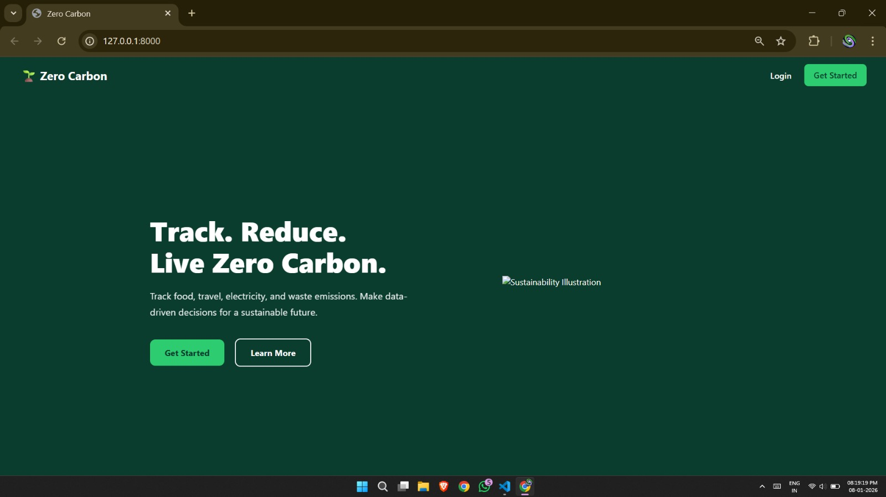
</p>

---

## 📌 Overview

**ZeroCarbon** is a comprehensive, enterprise-grade sustainability platform developed at **KIIT (Deemed to be University), Bhubaneswar, India**. It tackles two critical environmental challenges simultaneously:

1. **Carbon Footprint Tracking** — via a scalable Distributed Microservices Backend built with Java Spring Boot.
2. **AI-Powered Waste Classification** — via a trained YOLOv8 deep learning model that classifies waste in real time into 6 categories.

> ⚠️ **Note:** The AI/ML module (YOLOv8 model) is currently maintained as a separate component and has not yet been integrated into this repository. Integration is planned as part of future development.

---
## ✨ Key Features

- 🔐 **Stateless JWT Authentication** — RFC 7519-compliant, edge-enforced via Spring Cloud API Gateway
- 🌿 **Carbon Emission Calculator** — Deterministic linear model with standardized emission factors
- 🤖 **YOLOv8 Waste Detection** *(separate module — integration in progress)* — Real-time multi-object detection achieving **>90% mAP@50** on primary waste categories
- ♻️ **Rule-Based Recommendation Engine** — Maps detected waste to actionable eco-friendly disposal guidance
- 🐳 **Fully Containerized Infrastructure** — Docker Compose orchestration with PostgreSQL 16 and Redis 7.2
- ⚡ **API Gateway Edge Security** — Unauthorized requests rejected in **~12ms** before reaching downstream services

---

## 🏗️ System Architecture

```
Client Request
      │
      ▼
┌─────────────────────────────┐
│  Spring Cloud API Gateway   │  ← Port 8080
│  (JWT Validation Filter)    │
└────────────┬────────────────┘
             │
    ┌────────┴────────┐
    ▼                 ▼
┌──────────┐   ┌─────────────────┐
│  Auth    │   │  Carbon Core    │
│ Service  │   │    Service      │
│ Port 8081│   │   Port 8082     │
└──────────┘   └────────┬────────┘
                        │
              ┌─────────┴──────────┐
              ▼                    ▼
        ┌──────────┐         ┌──────────┐
        │PostgreSQL│         │  Redis   │
        │  Port    │         │  Cache   │
        │  5432    │         │  6379    │
        └──────────┘         └──────────┘
```

The backend follows a **Database-per-Service** microservices pattern, ensuring fault isolation — a failure in the Carbon Core Service cannot compromise the Authentication layer.

---

## 🔬 Carbon Emission Model

Total emissions are calculated using the following deterministic linear model:

```
TotalEmission = Σ (UnitValue_i × EmissionFactor_i)
```

| Activity | Emission Factor |
|---|---|
| Automotive Transport | 0.20 kg CO₂e / km |
| Electricity Usage | 0.40 kg CO₂e / kWh |
| Meat Meal | 2.50 kg CO₂e / meal |
| Vegan Meal | 0.50 kg CO₂e / meal |

---

## 🤖 AI Module — YOLOv8 Waste Detection *(Separate Component)*

> **Status:** Trained and validated independently. Full integration into the platform is in progress.

### Model Details

| Parameter | Value |
|---|---|
| Architecture | YOLOv8 Medium (`yolov8m.pt`) |
| Training Epochs | 100 |
| Batch Size | 16 |
| Image Resolution | 640 × 640 px |
| Framework | PyTorch + CUDA |
| Augmentation | Mosaic, MixUp, Copy-Paste |

### Waste Categories

`BIODEGRADABLE` · `CARDBOARD` · `GLASS` · `METAL` · `PLASTIC` · `OTHER`

### Performance Results (mAP@50)

| Waste Category | Precision | Recall | mAP@50 | Avg. Confidence |
|---|---|---|---|---|
| PLASTIC | 0.94 | 0.91 | **0.92** | 0.93 |
| CARDBOARD | 0.92 | 0.88 | **0.90** | 0.88 |
| BIODEGRADABLE | 0.89 | 0.85 | **0.87** | 0.91 |
| METAL | 0.88 | 0.84 | **0.86** | 0.85 |
| GLASS | 0.85 | 0.80 | **0.82** | 0.84 |
| OTHER | 0.78 | 0.72 | **0.75** | 0.79 |

---

## 🛠️ Tech Stack

| Layer | Technology |
|---|---|
| Backend Framework | Java Spring Boot |
| API Gateway | Spring Cloud Gateway |
| Authentication | JWT (RFC 7519) |
| AI / CV Model | YOLOv8 (Ultralytics) + PyTorch |
| Database | PostgreSQL 16 |
| Cache | Redis 7.2 |
| Containerization | Docker & Docker Compose |
| Security Protocol | TLS v1.3 |
| API Standard | REST / HTTP 1.1 |

---

## 📸 Screenshots

### 🔐 Login Page
<p align="center">
  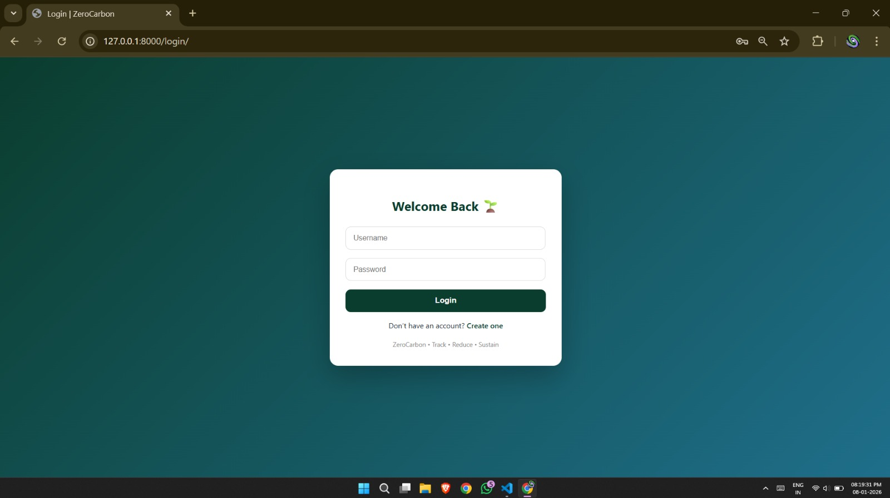
</p>

### 📝 Signup Page
<p align="center">
  
</p>

### 🏠 Dashboard
<p align="center">
  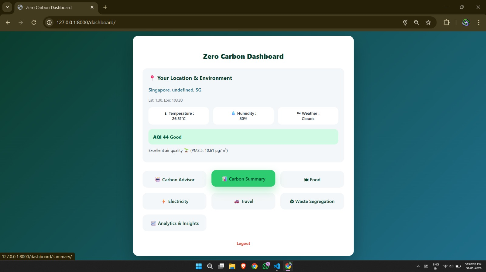
</p>

### 📊 Carbon Emission Summary
<p align="center">
  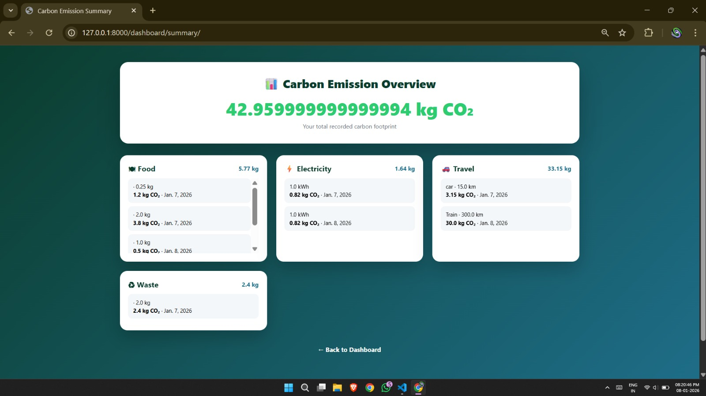
</p>

### 🍽️ Food Consumption
<p align="center">
  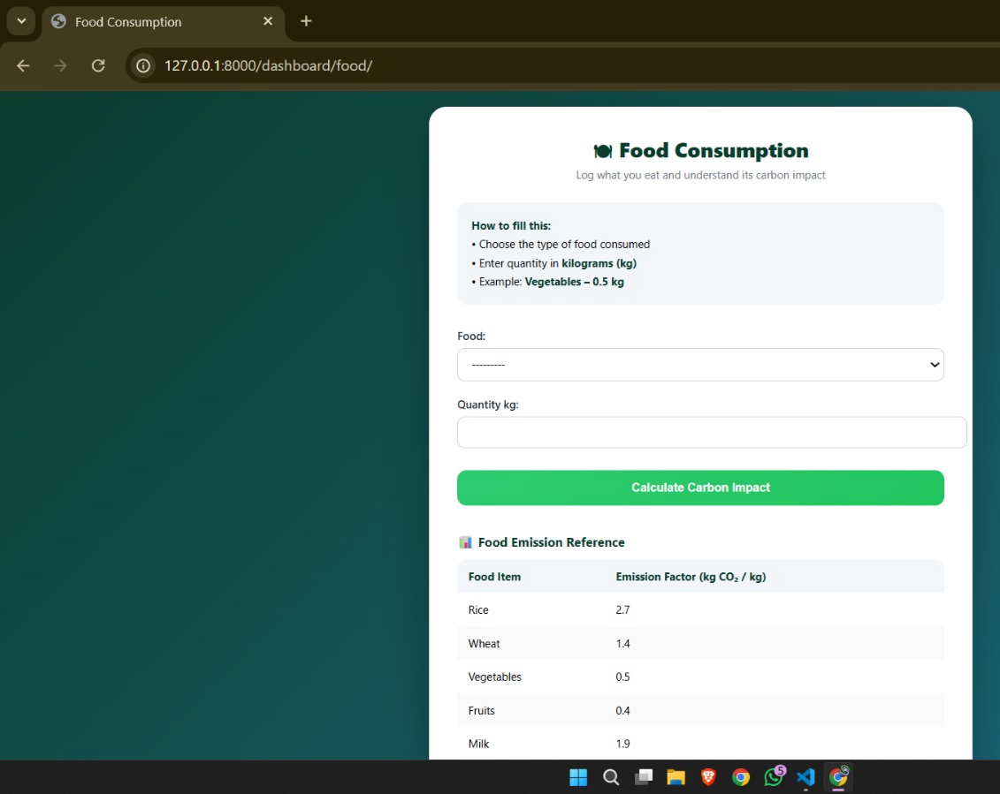
</p>

### ⚡ Electricity Usage
<p align="center">
  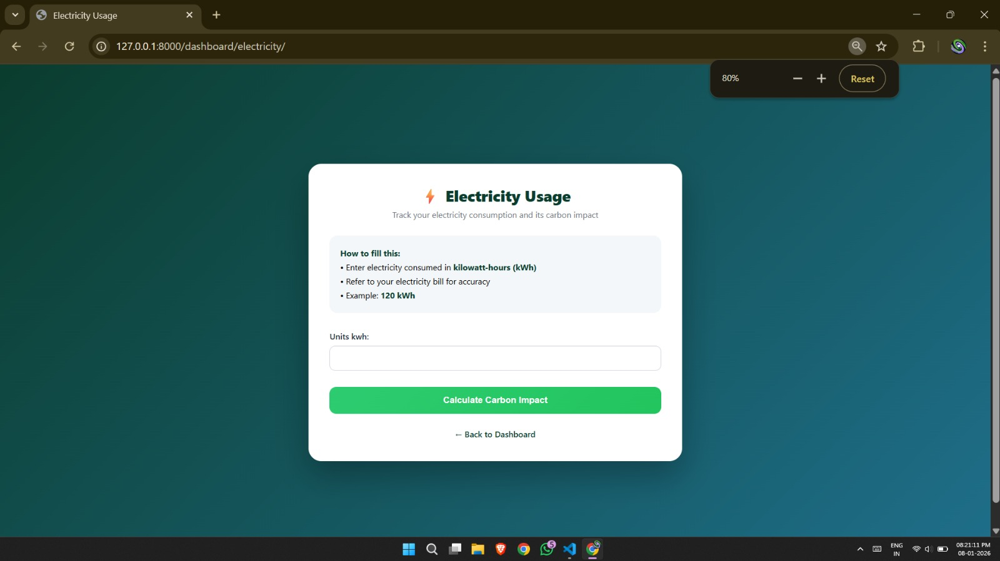
</p>

### 🚗 Travel Details
<p align="center">
  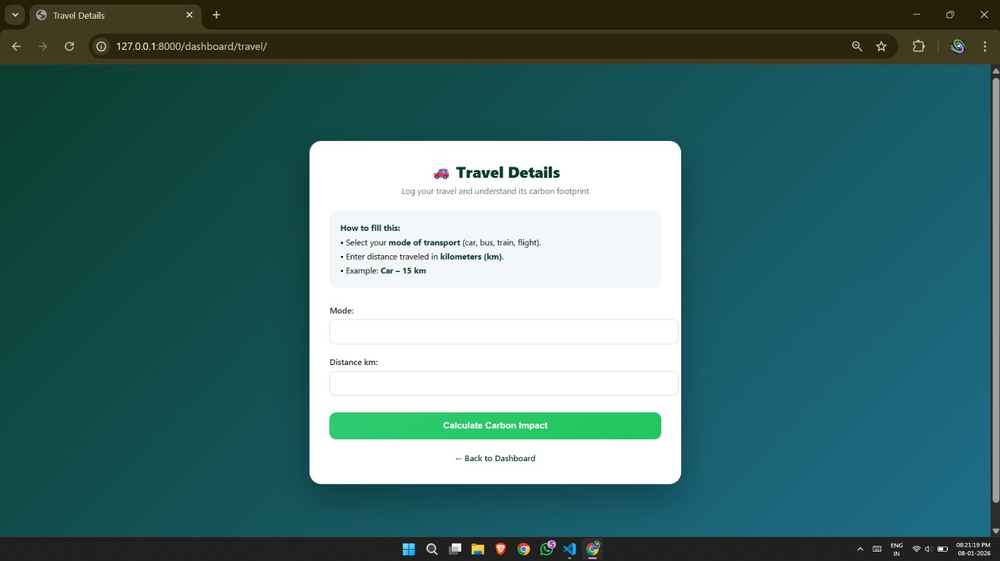
</p>

### ♻️ Waste Segregation
<p align="center">
  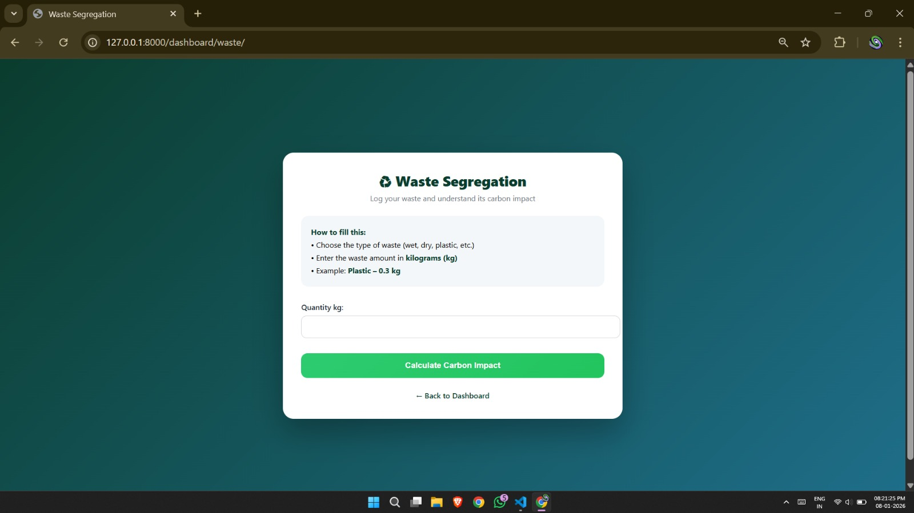
</p>

### 📈 Analytics & Insights

<p align="center">
  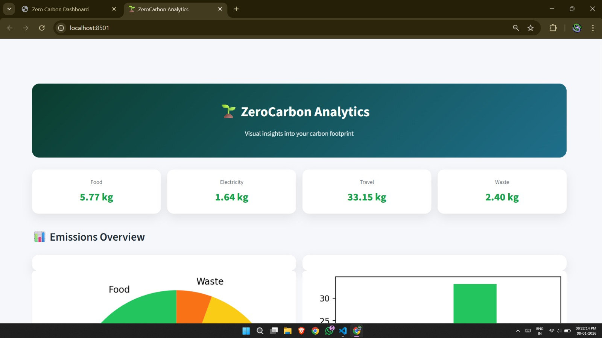
</p>

<p align="center">
  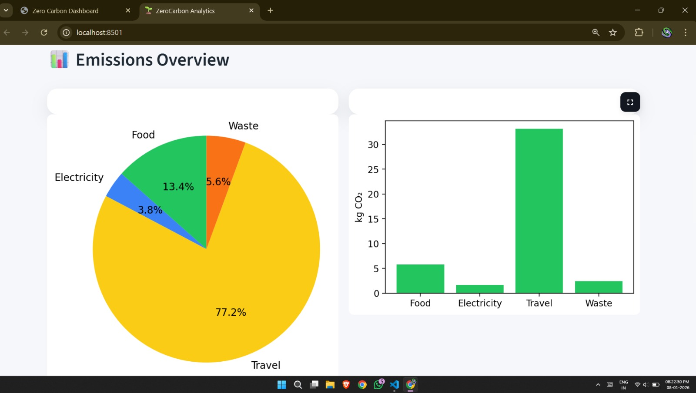
</p>

<p align="center">
  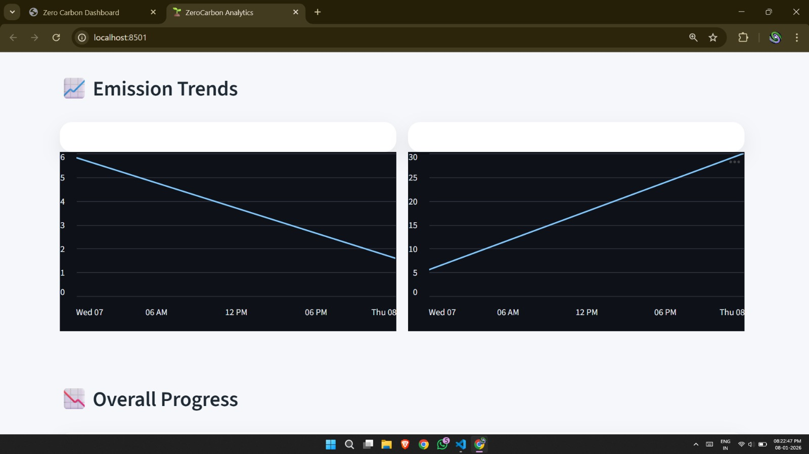
</p>

<p align="center">
  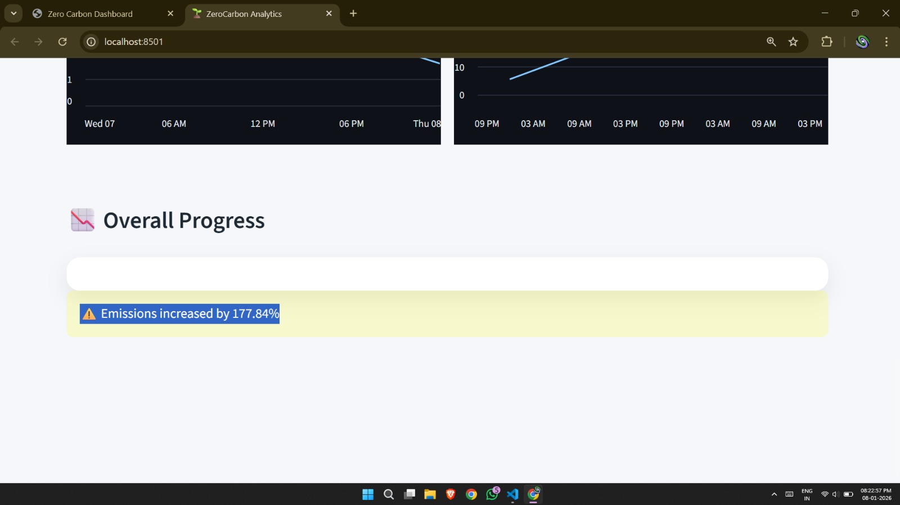
</p>

### 🤖 AI Carbon Advisor
<p align="center">
  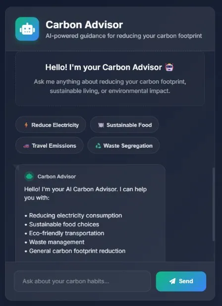
</p>

### 🗑️ YOLOv8 Waste Detection *(Separate ML Module — Integration in Progress)*
<p align="center">
  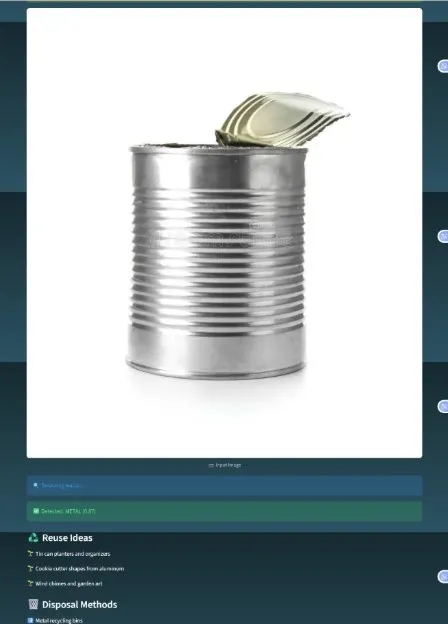
</p>

---

## 🚀 Getting Started

### Prerequisites

- [Docker](https://www.docker.com/) & Docker Compose installed
- Java 17+ (for local development without Docker)
- Git

### Installation

1. **Clone the repository**
   ```bash
   git clone https://github.com/ShreyashiMalla/ZeroCarbon.git
   cd ZeroCarbon
   ```

2. **Start all services using Docker Compose**
   ```bash
   docker-compose up --build
   ```

   This will spin up:
   - API Gateway on `http://localhost:8080`
   - Auth Service on `http://localhost:8081`
   - Carbon Core Service on `http://localhost:8082`
   - PostgreSQL on port `5432`
   - Redis on port `6379`

3. **Verify services are running**
   ```bash
   docker ps
   ```

---

## 📡 API Reference

### Authentication

| Endpoint | Method | Auth Required | Description |
|---|---|---|---|
| `/api/v1/auth/register` | `POST` | No | Register a new user |
| `/api/v1/auth/login` | `POST` | No | Login and receive JWT token |

### Carbon Activities

| Endpoint | Method | Auth Required | Description |
|---|---|---|---|
| `/api/v1/activities/log` | `POST` | ✅ Yes | Log a new carbon activity |
| `/api/v1/activities/summary` | `GET` | ✅ Yes | Get total emission summary |

### Gateway Security Test

| Endpoint | Auth | Latency | Status |
|---|---|---|---|
| `/api/v1/auth/login` | None | ~45ms | `200 OK` |
| `/api/v1/activities/summary` | Valid JWT | ~27ms | `200 OK` |
| `/api/v1/activities/summary` | None | ~12ms | `401 Unauthorized` |

> Unauthorized requests are rejected at the **Gateway edge** in ~12ms — before consuming any downstream service resources.

---

## ♻️ Waste Recommendation Engine

Upon waste detection, each classified item is queried against a custom `WASTE_DATABASE`. The rule-based engine maps each category to specific disposal actions:

| Category | Disposal Guidance |
|---|---|
| PLASTIC | Recycle: Rinse thoroughly. Dispose in the **Blue Bin**. |
| BIODEGRADABLE | Compost: Add to compost bin or green waste. |
| CARDBOARD | Recycle: Flatten before placing in the **Blue Bin**. |
| GLASS | Recycle: Place in **Glass Recycling Bin**. |
| METAL | Recycle: Clean and place in **Metal Recycling Bin**. |
| OTHER | General Waste: Dispose in the **Black Bin**. |

---

## 📋 Industry Standards Compliance

| Standard | Description |
|---|---|
| RFC 7519 (JWT) | Stateless identity verification for all protected endpoints |
| TLS v1.3 | Encrypted communication between client and API Gateway |
| IEEE 802.11 b/g/n | Wireless networking accessibility across local area networks |
| REST / HTTP 1.1 | All inter-service and client-server communications |
| OCI Docker Standards | All microservices packaged for cloud portability |

---

## 🔮 Future Scope

- [ ] **Edge Computing Deployment** — YOLOv8 inference engine at the point of disposal to minimize latency
- [ ] **IoT Sensor Integration** — Bin fill-level monitoring via IoT sensors
- [ ] **LLM-Powered Coaching** — Personalized longitudinal sustainability coaching using Large Language Models
- [ ] **Full ML Integration** — Merging the standalone YOLOv8 module into the main platform

---


## 📄 License

This project is licensed under the [MIT License](LICENSE).

---

<div align="center">
  <strong>Built with 💚 for a sustainable future — ZeroCarbon, KIIT University</strong>
</div>
